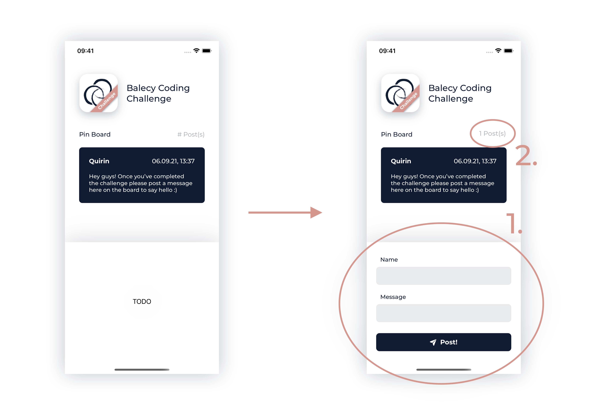

# Balecy Coding Challenge

This repository contains an iOS project for the coding challenge of the Interdisciplinary Project (IDP) at Balecy.
Should you consider applying for the project and taking the challenge, please read the following instructions.

## Instructions

The project implements a pin board within an example app. Use the latest version of Xcode to build and run the application and 
inspect the starting point of this challenge.

The challenge consists of two tasks:

1. Implement two text fields and a button within `ComposePostView` like shown on the mock-up below. The newly implemented UI should allow users to post a new message to the pin board. Hint: you also need to edit `ComposePostViewModel` to call `DatabaseService.addPost(author: String, message: String)`. Once you're done, please use your UI to leave a message on the board :)
2. Implement showing the number of posts on the board on the label on the top right of the board (see mock-ups).

Please implement these two tasks on a **private** fork of this repository. Once you're done, please invite me to your private fork and let me know about it via `quirin.schweigert@balecy.com`.

